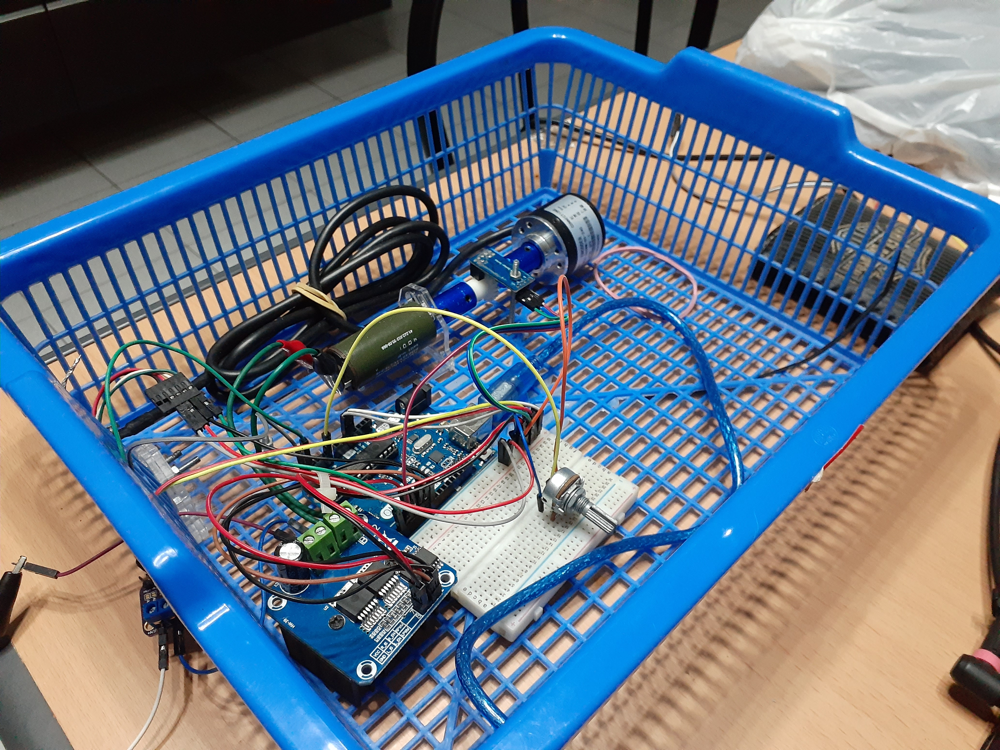

# MICRON
MICRON is a capstone project concerning with fault detection, control system and IoT, developed by three electrical engineering students at Universitas Gadjah Mada.

## Dependencies
* [Just Another Control Library (JACL)](https://github.com/koseng-lc/jacl)
* [Serial Wrapper](https://github.com/koseng-lc/serial-wrapper)
* [MQTT Handler](https://github.com/koseng-lc/mqtt-handler)

## Gallery

## Team
* Lintang Erlangga (koseng)
* Bagas Budhi Permana
* Ulynnuha Setiyadi
